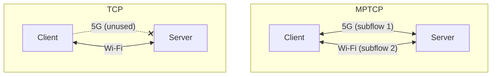
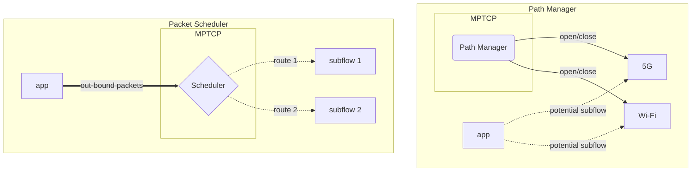

Multipath TCP or [MPTCP](https://en.wikipedia.org/wiki/Multipath_TCP) is an extension
of [TCP](https://en.wikipedia.org/wiki/Transmission_Control_Protocol) described
in [RFC 8684](https://www.rfc-editor.org/rfc/rfc8684.html). It allows a device to
make use of multiple interfaces at once to send and receive TCP packets over a single
connection. MPTCP can aggregate the bandwidth of multiple interfaces, it also allows
a fail-over if one interface is down the traffic is seamlessly transferred to the others.

Here is how it works! When a new socket is created with `IPPROTO_MPTCP` a *subflow*
(or *path* both terms are interchangeable) is created, this *subflow* consist of
a regular TCP connection that is used to transmit data trough one interface. Additional
*subflows* can be negotiated later between the hosts. For the distant host to be
able to detect the use of MPTCP, a new field is added to the *option* field of the
underlying TCP *subflow*. This field contains, amongst other things, `MP_CAPABLE`
that tells the other host to use MPTCP (if it's socket support's it). If the distant
host or any [middlebox](https://en.wikipedia.org/wiki/Middlebox) in between does
not support it, the response `SYN+ACK` packet will not contain the MPTCP options
in the *option* field. In that case, the connection will be 'downgraded' to plain
TCP and will continue without additional *subflows*.

This behavior is made possible by two internal components:
* **path manager**, it is responsible for the managing of *subflows* from creation to deletion.
* **packet scheduler**, it is tasked with choosing which available *subflow* to send
packets to. The packet scheduler is also responsible for the load balancing of the
packets across the *subflows* making use of the available bandwidth.

## Features

As of Linux v5.19, major features of MPTCP include:

* Support of the `IPPROTO_MPTCP` protocol in `socket()` system calls.
* Fallback from MPTCP to TCP if the peer or a middlebox do not support MPTCP.
* Path management using either an in-kernel or userspace path manager.
* Socket options that are commonly used with TCP sockets.
* Debug features including MIB counters, diag support (used by the `ss` command), and tracepoints.

See the
[ChangeLog](https://github.com/multipath-tcp/mptcp_net-next/wiki/#changelog)
for more details.

## Communication

* Mailing List: mptcp@lists.linux.dev (and [archives](https://lore.kernel.org/mptcp))
* IRC: [#mptcp](https://web.libera.chat/?nick=mptcp-dev-guest?#mptcp) on libera.chat
* Online [Meetings](https://github.com/multipath-tcp/mptcp_net-next/wiki/Meetings)

## Projects

* Maintained by MPTCP community members
  * Kernel development on GitHub: https://github.com/multipath-tcp/mptcp_net-next/
  * Multipath TCP Daemon: https://github.com/intel/mptcpd
    * The `mptcpd` daemon can do full userspace path management or control the in-kernel path manager.
    * Includes the `mptcpize` utility to allow legacy TCP binaries to use MPTCP.
  * Packetdrill with MPTCP enhancements: https://github.com/multipath-tcp/packetdrill
* Projects with MPTCP-related enhancements
  * [iproute2](https://wiki.linuxfoundation.org/networking/iproute2) (for the `ip mptcp` command)
  * [Network Manager](https://networkmanager.dev): MPTCP features are included starting with v1.40.
  * [Multipath TCP applications](https://github.com/mptcp-apps/): A project to coordinate MPTCP updates for popular TCP applications.

## Kernel Development

* [Git Repository](https://github.com/multipath-tcp/mptcp_net-next.git) ([branch descriptions](https://github.com/multipath-tcp/mptcp_net-next/wiki/Git-Branches))
* [Issue tracker](https://github.com/multipath-tcp/mptcp_net-next/issues)
* [Patchwork](https://patchwork.kernel.org/project/mptcp/)
* [Continuous Integration](https://github.com/multipath-tcp/mptcp_net-next/wiki/CI)
* [Testing](https://github.com/multipath-tcp/mptcp_net-next/wiki/Testing)

<!-- commented because it should be integrated into one of the above sections (which might themselves need to change)
This site is new and still evolving, so please refer to the [Linux MPTCP Upstream Project wiki](https://github.com/multipath-tcp/mptcp_net-next/wiki) for additional information.

_For out-of-tree kernels before v5.6 and an implementation of the experimental [MPTCP v0](https://www.rfc-editor.org/rfc/rfc6824.html) protocol, see https://multipath-tcp.org/_ -->
